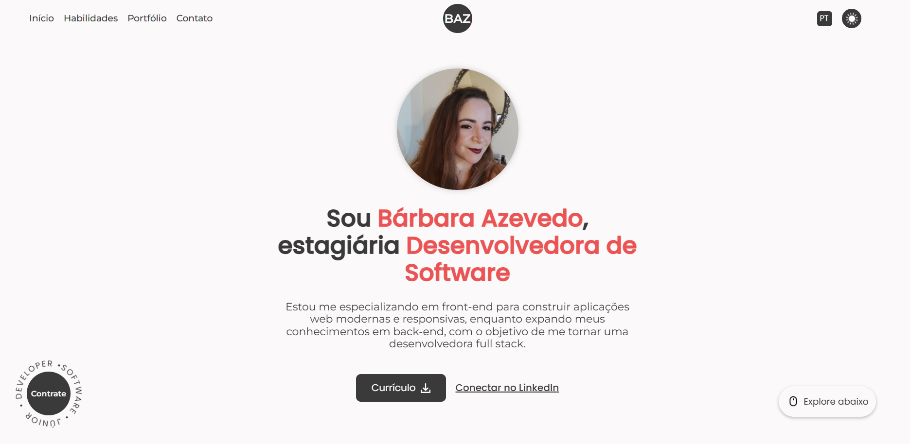
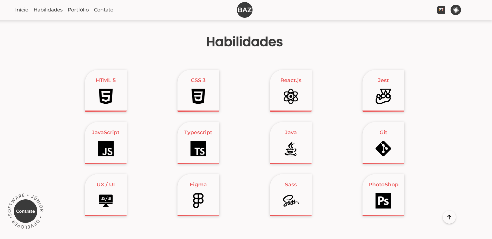
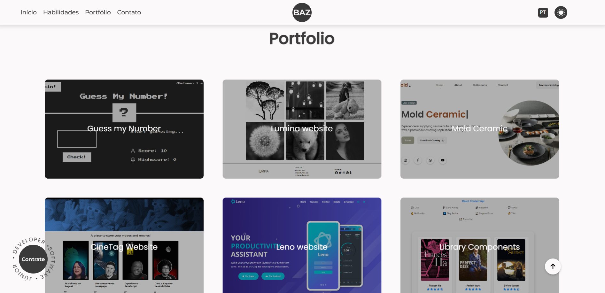

# Desafio - Website Pessoal com HTML, CSS e JavaScript

Este projeto consiste na construção de um website pessoal completo, partindo do zero até uma aplicação 100% funcional em ambiente local. O desafio explora a integração de boas práticas de HTML semântico, estilização CSS (com SASS), manipulação dinâmica com JavaScript.

## 📦 Sobre o projeto

O objetivo é desenvolver uma SPA (Single Page Application) totalmente responsiva, acessível e multilíngue (PT/EN), com troca de tema e persistência das preferências do usuário. O site representa um portfólio pessoal com páginas dedicadas à apresentação, habilidades, projetos e contato.

### Estrutura de páginas:
- **Home:** Apresentação pessoal;
- **Skills:** Soft e hard skills;
- **Portfolio:** Projetos desenvolvidos;
- **Contato:** Formas de contato.

## ✅ Funcionalidades

- Interface responsiva para diferentes tamanhos de tela;
- HTML semântico com foco em acessibilidade;
- Troca entre temas **Light** e **Dark**;
- Troca de idiomas **Português** e **Inglês**;
- Preferências de tema e idioma persistem entre sessões;
- Download de currículo (CV) em PDF conforme o idioma;
- Utilização de `reset.css` para consistência entre navegadores;
- Gerenciamento de dependências com Node.js (`package.json`).

## 🎯 Objetivos do desafio

- Reforçar conhecimentos de HTML, CSS e JavaScript em um projeto real;
- Praticar responsividade, semântica e acessibilidade na construção de interfaces;
- Aplicar manipulação de DOM e lógica JS para interação com o usuário;
- Explorar conceitos de arquitetura web e modularização do projeto;
- Introduzir o uso do **Sass**.

## 🚀 Tecnologias utilizadas

- HTML5
- CSS3 (com Sass)
- JavaScript
- Node.js

## 📷 Homepage Demonstração


## 📷 Habilidades Demonstração


## 📷 Portfólio Demonstração


## 🛠️ Como executar o projeto

1. Clone o repositório:
```
git clone https://dev.azure.com/DB-UnidadeTerra/workspace-mentorias/_git/barbara-azevedo-mentoria-front-desafio-website-from-scratch
```

2. Navegue até a pasta do projeto:
```
cd seu-repositorio
```

3. Instale as dependências:
```
npm install
```

4. Execute com um servidor local:
```
npm run sass
```

## ✨ Autor
Desenvolvido por Bárbara Azevedo durante mentoria do programa StartDB em Agosto de 2025, sob orientação de Felipe Christofoli.